# Exodus v1.3 — CLI Audit

**Started:** 2026-06-03
**Auditor:** Lucas (`lukemiha@gmail.com`, Member role, brand `flow2`)
**Scribe:** Claude (terminal — reads saved screenshots, writes findings + fixes)
**For:** Brad (implements) + any downstream AI he hands this to
**Surface under review:** the **Exodus CLI** (`exodus image`, `genesis`, `brand`, the spec wizard, `doctor`) — and the CLI↔dashboard seams it exposes.

**Companion pass:** the **dashboard** audit lives in its own repo (`exodus-v1.3-dashboard`, findings #37–46). This is the **CLI** companion. Finding numbers continue the shared audit sequence — #1–46 were prior dashboard/onboarding/creative passes; **this CLI pass is #47+.**

**📄 See also `exodus-v1.3-cli-full.md`** — the consolidated A–E writeup (app findings · process feedback · canonical architecture · reference data: engines/ad-types/triggers/caps · the executed-run record with all runIds).

---

## How to read this doc (for Brad + downstream AI)

Each finding is **self-contained** so it can be lifted out and worked in isolation:

- **ID** — `#NN` finding, `A.NN` the corresponding action item.
- **Area** — which surface (CLI command / flow / component).
- **Severity** — P0 (blocks customer / wrong-brand) · P1 (broken or badly confusing) · P2 (polish / nice-to-have).
- **What / Where / Repro / Screenshot / Expected / Proposed fix / Status** — observed behavior, exact location, steps, verbatim screenshot path, the intended behavior, the suggested change, and state.

Screenshots live in `screenshots/` and are **never edited** — saved exactly as captured. Filenames encode the finding: `NN-short-slug.png`.

---

## TL;DR — running summary

- **#52 (P0 — THE #1 issue overall)** — **Steering must be an explicitly-requested, first-class input** — and must support **steering-ONLY runs (no ad copy)** and **steering-EMPHASIS**. The flow has to ASK for the operator's steering instructions every time; sometimes the run is *for* an ad but the operator wants only their steering (no copy) to drive it, or wants steering weighted as primary. Steering stays Native-only.
- **#57 (P0 — Lucas: "SUPER FUCKING IMPORTANT")** — **No way to ingest raw Facebook ad copy / a FB Ad Library URL into the copy pipeline.** `genesis --reel` is IG/TikTok only; `--swipe <id>` needs an already-mined internal id; swipe mining is page-level (`fbPageRef`), not a single ad. **Nothing accepts a pasted FB ad's raw copy or an Ad Library ad URL/id directly.** Must add: paste raw FB ad copy → write, and/or `--fb-ad <url|id>` → fetch + write. (Swipe = the S in SOG; this blocks it.)
- **#59 (P1)** — **Swipe Library throws away the metadata ScrapeCreators already returns, and caps at 200.** Exodus stores only `headline/body/CTA/transcript` and caps `--list-swipes` at 200 with no pagination — discarding impressions/reach, dates, `total_active_time` (longevity), `collation_count` (variant count), spend, status, and the `cursor`/`searchResultsCount` (true total). We want: store it all · sort by date/longevity/variant-count/impressions · a **score = impressions × longevity (× variants)** · filter by brand/date/active · **semantic hook search** · paginate (no 200 cap) · **scope mining** so multi-product brands don't flood the library. "The data exists upstream — store it + surface it + let me sort/search it."
- **#58 (P1)** — **The whole swipe pipeline is broken end-to-end** — no working path from "here's a competitor FB ad" to "written copy." research/watchlist needs real page names (can't derive from an ad link); mining is page-level (`fbPageRef`/`view_all_page_id`) which a raw ad URL doesn't surface; `--swipe` needs an already-mined id. Every route requires manually grabbing names / page-URLs / pasted text. Lucas: *"that process is pretty much all broken… pretty important."* (Compounds #57; v1.2 #28/#30.)
- **#47 (P1)** — **"Native" is mislabeled — it's the category, not an engine.** Native is the *tab*; the two engines under it are **Reptile** and **Copy-Derived**. There is no standalone "Native" engine — yet a run card reads "Creative Suite — **Native**" while badged **Reptile**, because CLI `--type native` silently maps to the Reptile engine. Customer can't tell which engine ran. Fix the taxonomy across CLI + dashboard + run-card labels.
- **#48 (P1)** — **Generation auto-fires a default suite without asking — the config IS the creative call.** Dropping 4 ads fired **three runs in one batch** (Template `auto·1:1` + Copy-Derived 4-concept + Reptile 4-concept) that Lucas never selected. It should *ask first* via a spec step (the Lucas-approved **Engine → Scope → Aspect → Count → Submit** wizard), and ship bounded **run formats (F1–F6)** instead of open spray. Default to **nothing**; never generate unasked output.
- **#49 (P2)** — **No cancel command in the CLI.** Once runs are fired there's no way to stop them. Add `exodus image cancel <runId>` / batch-cancel.
- **#50 (P1)** — **Brand Info (image-gen assets) isn't prompted or validated when empty; two "brand" layers are conflated; no CLI setter.** Image gen ran with founder/product empty while `doctor` said "READY" (that only reflects the partial copy layer). Founder name + product photos are dashboard-only — no CLI to set them.
- **#51 (P1)** — **Manual template runs cap at 50 images/run and just error past it.** "2 per all 33" = 66 images > the 50-cap, so the run fails instead of completing. The front door (`image`/`template`) should **auto-split into multiple runs (or warn up front)** rather than erroring. (Re-surfaces v1.2 #33's 50-cap.)
- **#53 (✅ approved design)** — **Copy flow: the "what do you want done with this idea?" gate.** After a raw idea, before genesis writes, a menu offers **Write the ad** (straight to genesis, banks nothing — default) · **Both** (write now AND save to Idea Bank) · **Just save it** (`idea add`, no copy yet). Lucas: *"kinda like this."* Matches the SOG bank-seeds-vs-rip-end-to-end model.
- **#54 (P1)** — **Idea Bank → writer dispatch silently SKIPS an idea that's already running; can't generate the same idea multiple times.** Dispatching an idea returned **"Dispatched 0 idea(s) to the writer. Skipped 1"** — it skipped because a Brief run for that idea was already "running / No doc yet." **Root cause confirmed:** the idea is *locked* while its run is in flight, so every re-dispatch (note and all) is skipped; `genesis run --brief` bypasses the lock. Lucas: *"you should be able to generate it multiple times."* Each dispatch should fire a NEW run (re-generation allowed); at most a soft confirm, never a silent skip — and the toast should say *why* it skipped.
- **#56 (P1 — core copy-flow requirement)** — **Ask the pre-write questions before writing ANY copy — offered, never blocking.** Every time, before genesis writes: **1) Segment · 2) Awareness level · 3) Primer (don't pre-decide — ASK) · 4) Mechanism · 5) CTA/where it's driving · 6) Overall guidelines/steering.** Default rule (Lucas: *"really important"*): the questions are **offered but never block** — skip any and it runs a default. Copy analog of the image #48 spec wizard; carries the #52 non-blocking-steering rule.
- **#55 (P1)** — **Template renders fail under concurrency (Convex OCC).** In the big template batch a large share of tiles came back **"Failed"** with `creativeSuiteTemplate:claimRenderSlot failed (503): OptimisticConcurrencyControlFailure` on the `creativeSuiteTemplateRenders` table — write contention from many renders claiming slots at once (amplified by #51's 50-cap split firing several runs together). Lots worked, lots failed; no auto-retry. Backend needs OCC-resilient slot-claiming + retry.

---

## The architecture (canonical — Lucas, 2026-06-03)

> This is the authoritative model the spec/UX in #47–#50 must conform to. The two
> levers (Steering, Realism) **do not cross**: Steering is Native-only, Realism is
> Template-only.

You start with one input: **ad copy**. It branches into two independent engine families.

```
                          AD COPY
                             │
            ┌────────────────┴────────────────┐
            │                                  │
        NATIVE                             TEMPLATE
   (images from your copy)        (your copy poured into fixed formats)
            │                                  │
    ┌───────┴───────┐                  ┌───────┴───────┐
  REPTILE      COPY-DERIVED          AUTO            MANUAL
 13 psych      literal ads      system picks      you pick the
 triggers →    from your        the ad-types      ad-types + how
 wild          copy blocks                        many of each
 concepts
            │                                  │
   ▸ count per engine                 ▸ 33 ad-types available
   ▸ aspect (1:1 / 9:16)              ▸ realism: ON or OFF
   ▸ STEERING ◄ your ideas              (one switch, whole batch)
```

**The two levers, and where each one lives**

| Lever | What it does | Lives on |
|---|---|---|
| **Steering** | injects your own idea/direction into the render | **Native only** (Reptile + Copy-Derived) |
| **Realism** | photographic-realism guardrail | **Template only** (single on/off for all) |

They don't cross. Steering never touches templates; realism never touches native.

**The decision space, in order — four choices:**
1. **Which ads** — one or many
2. **Which engines** — any mix of {Reptile, Copy-Derived, Template}
3. **Native config** — count per engine · aspect · steering (your ideas, optional)
4. **Template config** — auto or manual (which formats + how many each) · realism on/off

---

## Findings

### #47 — "Native" is mislabeled: it's the category, not an engine (CLI `--type native` actually = Reptile)
- **Area:** New batch run modal → **Engine** toggle (Native | Template) **+** run-result cards **+** CLI `exodus image --type native`.
- **Severity:** P1 — a run labeled "Native" is actually the Reptile engine; the customer can't tell what ran, and the vocabulary is inconsistent across CLI / dashboard / cards.
- **What:** "Native" is being used as if it's an engine when it's really the **category**:
  - **Native is the tab/category.** Under it sit **two engines**, each with its own per-aspect image count:
    - **Reptile** — reptile-brain triggers, 13 psychological angles → wild concepts.
    - **Copy-Derived** — native ads built from your copy blocks.
  - There is **no standalone "Native" engine.** But a completed run card reads **"Creative Suite — Native"** while its badge says **Reptile** (see screenshot) — because the **CLI `--type native` maps to the Reptile engine.** So "Native" silently means "Reptile" in the CLI, and the dashboard inherits the mislabel.
  - Lucas: *"There's no fucking native; copy-derived and reptile are both versions of native. There's not a second native one."* Confirmed by the CLI agent that fired the run: *"`--type native` confusingly maps to the Reptile engine — that's why the dashboard badged my 'Native' run as Reptile. A genuine CLI naming bug."*
- **Where:** Engine toggle at top of New batch run modal; result-card title vs badge; CLI `--type` argument.
- **Repro:**
  1. Fire a run with CLI `exodus image --type native` (or pick the Native engine + Reptile in the modal).
  2. Open the run card → title says **"Creative Suite — Native"**, badge says **"Reptile."** Title and badge disagree; "Native" is presented as an engine.
**Screenshot:**

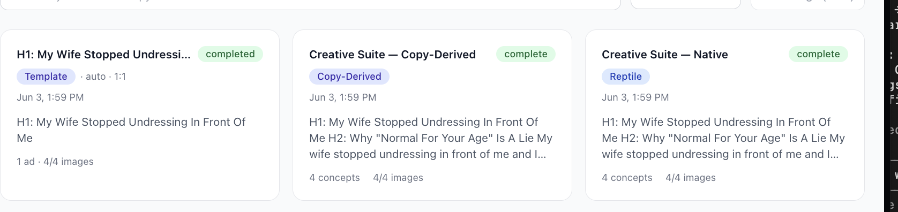

**Screenshot:**

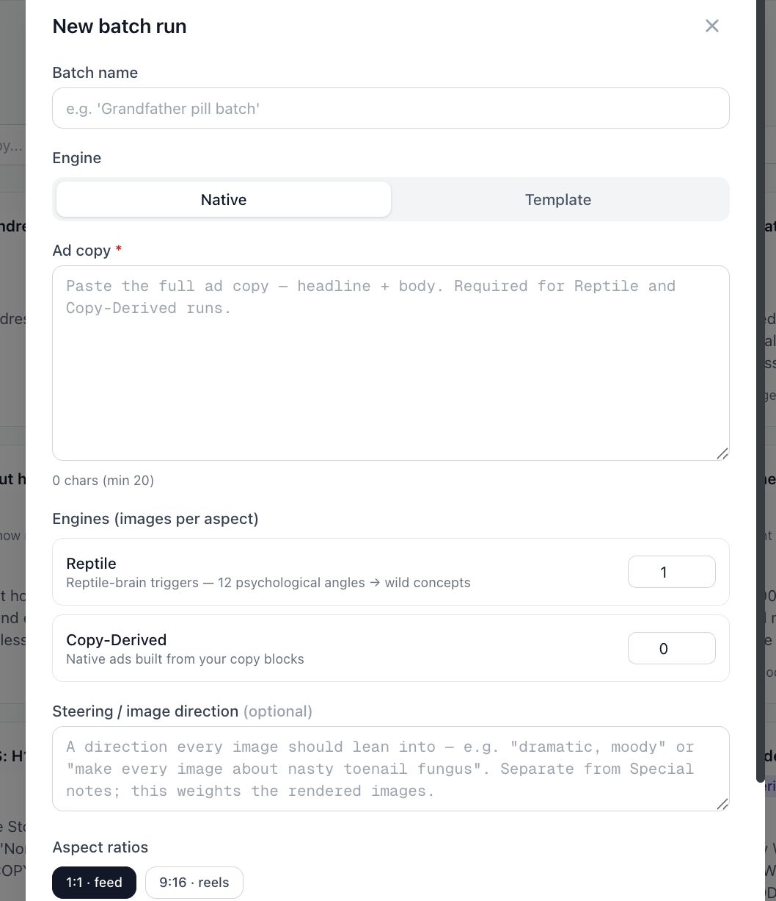

- **Expected:** One consistent taxonomy everywhere. **Native = category** containing **Reptile** + **Copy-Derived**. "Native" never appears as an engine name; runs are always labeled by the actual engine that ran.
- **Proposed fix:**
  1. **CLI:** deprecate/rename `--type native`. Expose the two real engines explicitly (e.g. `--engine reptile` / `--engine copy-derived`). If `--type native` must stay for back-compat, require an engine sub-choice or alias it transparently and label the run by the resolved engine.
  2. **Dashboard:** keep **Native / Template as category tabs**, but **label every run by its engine** (Reptile / Copy-Derived) — never "Native."
  3. **Make card title + badge agree** (no "Native" title paired with a "Reptile" badge).
**Screenshot:**

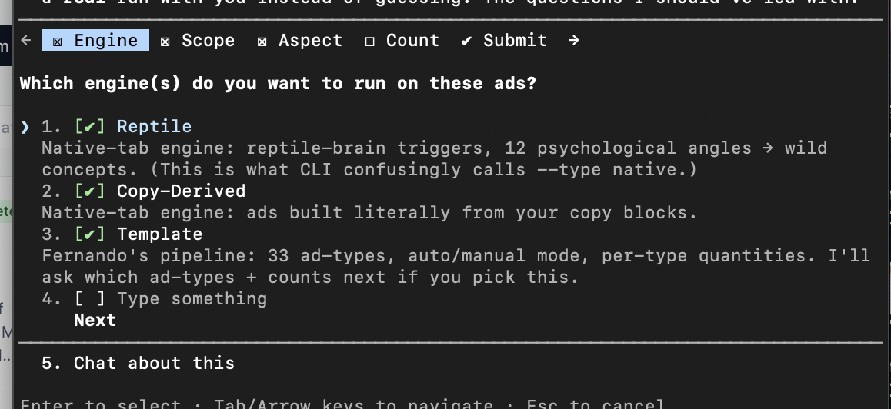

- **Status:** open — CLI-level + dashboard-level. (See memory `reference_exodus_image_engines` for the canonical taxonomy.)

### #48 — Generation auto-fires a default suite without speccing; needs a config step + zero unasked output
- **Area:** Image/copy generation flow — CLI `exodus image` **and** the New batch run modal.
- **Severity:** P1 — produces output the customer never requested (wasted spend + time); for image gen the **configuration IS the creative decision**, so skipping it defeats the point.
- **What:**
  - Dropping **4 ads at once** auto-fired **three runs in a single batch** (all stamped Jun 3, 1:59 PM):
    - **Template** — `auto · 1:1`, "1 ad · 4/4 images"
    - **Copy-Derived** — "4 concepts · 4/4 images"
    - **Native / Reptile** — "4 concepts · 4/4 images"
    - None of these were explicitly chosen. Lucas: *"You're just going and generating shit I didn't even ask for."*
  - **Before generating, the system should ask** (this is the spec the run needs):
    - **Native engines:** Reptile? Copy-Derived? **how many each** per aspect?
    - **Template:** auto vs **manual** mode; **which** of the **33 ad-types**; **per-type quantities** (e.g. testimonial:3, hero:2); model (**gpt-image-2 / nano-banana-pro**); realism on/off.
    - **Steering / image direction** (optional) + **aspect** (1:1 feed / 9:16 reels).
  - **Steering is a specific, optional refinement** the operator gives *if they want* — not a default the engine should assume. (Reinforces #37.)
  - **Brand-profile nuance — corrected (see #50):** an initial `doctor` read said "foundation: READY" and the run proceeded as if brand context existed. That was misleading on two counts: (a) the **copy foundation** is only *partial* (Audience Concerns ✅, Brand Voice ❌, Core Offer ❌); (b) the thing that actually feeds **image** gen — **Settings → Brand Info** (founder name + product photos) — is **completely empty** for flow2, and the run was **never prompted or validated against it.** So it's both a missing-**ask** (this finding) *and* a missing-**validation** of empty assets (#50). Don't conflate the two brand layers.
- **Where:** CLI `exodus image` (fires a suite from ad copy with no spec prompt); dashboard New batch run modal (the fields exist but a suite can fire without an explicit per-engine/per-template spec).
- **Repro:**
  1. Feed ~4 ads' copy into the generation flow.
  2. Observe **3 runs** fire (Template + Copy-Derived + Reptile) with **no prompt** for engines, counts, template ad-type, mode, model, or realism.
**Screenshot:**


**Screenshot:**


- **Expected:** A **spec / confirm step before any generation.** The user picks engines + per-engine counts, template mode + ad-type(s) + per-type quantities + model + realism, optional steering, aspect — **and nothing generates that wasn't asked for.** Default state = zero engines selected.
- **✅ Reference design — Lucas-approved (build to this):** the CLI now drafts the spec as a **step-through wizard** with a tab bar **Engine → Scope → Aspect → Count → Submit** — *nothing fires until Submit.* Lucas on seeing it: *"it needs to look like this — how can we make it explicit?"* Each step is an explicit choice with plain-language consequences and a **"Chat about this"** escape hatch:
  - **Engine** (multi-select): Reptile · Copy-Derived · Template · "Type something." Each option states what it is; Template's note says *"33 ad-types, auto/manual mode, per-type quantities — I'll ask which ad-types + counts next if you pick this"* (conditional branching). The Reptile note also explicitly says *"this is what CLI confusingly calls --type native"* — surfaces the #47 mislabel right in the UI. → `screenshots/48-spec-wizard-1-engine.png`
  - **Scope** ("Which of the 4 ads should I run?"): *Just one, go deep* · *All 4, separate runs* · *Ad #N only* · "Type something." → `screenshots/48-spec-wizard-2-scope.png`
  - **Aspect** ("What aspect ratio(s)?"): 1:1 feed · 9:16 reels · "Type something." → `screenshots/48-spec-wizard-3-aspect.png`
  - **Count / Submit:** per-engine quantities, then a single explicit Submit.
- **🧩 Open design — the config LOGIC (Lucas's question):** the hard part is the combinatorial space — **N ads × {Reptile, Copy-Derived, Template} × {auto | manual} × per-type counts × realism on/off**. Naïve "12 of everything on every ad" = ~150+ renders with no read on what's working. Proposed logic (architecture-level; CLI agent is pulling the real ad-type + reptile-trigger lists to put concrete numbers on it):
  1. **Make volume opt-in, not multiplicative-by-default.** The common path should be cheap: pick engine(s) → Scope = "one, go deep" → accept small count defaults → Submit. The full matrix is a power-user expansion, never the default.
  2. **Scope is the spend governor** (decide *before* counts): *one ad, go deep* (cheapest signal / stress test — the right default) vs *all N, separate runs* (breadth, more spend). Scope sets how many ads get rendered.
  3. **Count is PER-ENGINE, not per-ad×per-type×per-angle.** Native engines vary their own angles internally — Reptile samples from its 13 psychological triggers, Copy-Derived from the copy blocks — so the user sets a single per-engine concept count (e.g. 3), and the engine handles type variety. Don't expose 13 angle-counts.
  4. **Template is its own branch** (it has structure Native lacks):
     - **auto** = system picks a sensible ad-type spread (low-config default).
     - **manual** = user picks specific ad-types + a count each (e.g. `founder-note:2`, `testimonial:3`).
     - **Realistic enhancer** (on/off) is **Template-only** — a photographic-realism guardrail on the render prompt that doesn't rewrite the raw Template output (see screenshot). One per-batch toggle; default **off** unless the product needs photographic realism.
  5. **Signal-first defaults:** start narrow (1 strongest ad · each chosen engine at ~3 · Template auto · realism off ≈ ~9 renders), read the winners, *then* scale the winner — instead of spraying 150 up front.
**Screenshot:**

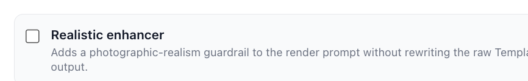

- **📐 Run formats (the bounded presets Lucas asked for — build these as selectable formats):** instead of an open combinatorial form, ship a menu of **named formats**, each a complete, testable run config. Native count = concepts per engine (engine varies its own angles); Template = ad-types + per-type counts + realism (template-only); aspects 1:1 feed / 9:16 reels.
  | Format | Ads | Engines & counts | Template | Realism | Aspect | ≈ Renders | Use |
  |---|---|---|---|---|---|---|---|
  | **F1 · Native Stress Test** | strongest 1 | Reptile 3 + Copy-Derived 3 | — | — | 1:1 | ~6 | fastest concept read |
  | **F2 · Native Breadth** | all | Reptile 2 + Copy-Derived 2 each | — | — | 1:1 | ~16 (4 ads) | which copy wins |
  | **F3 · Template Auto** | 1 | — | auto (system picks types) | off | 1:1 | auto | what templates yield, no fuss |
  | **F4 · Template Manual** | 1 | — | manual: pick 2–3 types + count (e.g. founder-note 2 / testimonial 2 / hero 2) | on | 1:1 | per picks | deliberate template formats |
  | **F5 · Winner Scale-Up** | the winner | Reptile 4 + Copy-Derived 4 + Template auto 4 | auto | on | 1:1 + 9:16 | ~24 | full coverage on a proven concept |
  | **F6 · Reels Pass** | chosen | chosen engines | optional | as set | 9:16 only | varies | reels/stories placement test |
  - **Principle:** each format is bounded and answers one question — never "12 of everything on every ad." Start at F1, scale the winner with F5. (Concrete type/trigger lists for F4 land when the CLI agent returns them.)
- **🚫 The deeper rule — ELICIT, never assume (Lucas, 2026-06-03, emphatic):** it is **not enough to "ask" by presenting a fully pre-decided plan.** The CLI did exactly that — staged all 4 ads, assigned engines + specific Reptile triggers + template formats per ad, totaled ~156 images, then said "give me 2 knobs and I fire." That's *assuming*, dressed as asking. Lucas: *"Stop assuming you know what the fuck I want. I will tell you… You can say 'do you want me to just do it for you?' but you have to ASK."* The spec step must **elicit each choice from the operator**; a "do it for me" path is allowed **only as an explicit option the user selects**, never as a default or a fait accompli.
- **✅ APPROVED WIZARD (converged 2026-06-03) — build to this (supersedes the Engine→Scope→Aspect→Count sketch above):** a **"who decides" gate**, then a **menu of questions** — one decision per screen, tab bar + ◄►, a "Chat about this" escape on every step. Replaces the rejected free-text "here are the slots, type it / Go" dump (`screenshots/48-tell-me-slots.png`; Lucas: *"can't we do this with a menu of questions?"*).
  - **Step 0 — Who decides** *(gate)*: **1) I'll tell you** (you give settings per-ad or globally; system builds exactly that, no creative calls) · **2) Do it for me** (system picks engines/formats/realism/counts and runs) · Type something · Chat. *(PNG lost to cache rotation — re-paste to archive. Clearer copy, per Lucas's "make it more readable":)*
    > **Who picks the settings?**
    > For these 4 ads, who chooses the setup — which engines run, which template formats, realism on or off, and how many of each?
    > **1. I'll tell you** — You give me the settings (one ad or all of them) and I build exactly that. I decide nothing on my own.
    > **2. Do it for me** — I pick the engines, formats, realism, and counts for all 4 ads, then run it.
    > **3. Type something else** · **4. Talk it through first**
  - **Wave 1 — Native:** **Ads** (multi-select; **default ALL ads selected** — Lucas: *"probably they want to run ALL ads"*) → **Engines** → **Aspect** → **Native count** → Submit. → `screenshots/48-menu-of-questions-ads.png` (+ step shots `48-spec-wizard-1-engine.png`, `-2-scope.png`, `-3-aspect.png`)
  - **Wave 2 — Template:** **Tmpl mode** (Auto = system picks ad-types, total count per ad · Manual = you pick which of the 33) → **Realism** (Off/On, one switch all templates) → **Tmpl count** (1/3/5 per type-per-ad; Auto = total per ad, Manual = per format) → Submit. → `screenshots/48-wizard-w2-mode.png`, `48-wizard-w2-realism.png`, `48-wizard-w2-count.png`
  - **Wave 3 — Manual ad-types** (only if Tmpl mode = Manual): pick which of the **33 ad-types** (grouped: Social proof · Authority/story · News/breaking · Data/science · Listicle/steps · Problem framing · Product · Bold/graphic) — same set across all ads, or per-ad. **Must be a real menu with a per-type quantity control — NOT free-text.** Current build dumps the grouped 33-type list and asks the operator to *type* "1. which formats · 2. how many per format" (`screenshots/48-wizard-manual-adtypes.png`). Lucas: *"this should be a MUCH clearer menu with an ability to choose how many of each I want."* → build a grouped **checklist** where each selected ad-type gets an inline **count stepper** (e.g. `testimonial ×3`, `hero ×2`); plus a "same across all ads / per-ad" toggle. (Steering stays Native-only — surface a one-line reminder here, not a field.)
- **Proposed fix:**
  1. **Insert this configuration step before any run** — CLI: the step-through wizard above (Engine→Scope→Aspect→Count→Submit). Dashboard: make submitting the modal the **only** way to fire — no implicit suite.
  2. **Template config surface:** which ad-type(s) of the 33, per-type quantities, auto vs manual, model (gpt-image-2 / nano-banana-pro), realism — all explicit choices (the wizard branches into these when Template is picked).
  3. **Default to nothing.** No engine fires until the user picks + hits Submit; never fire a full suite implicitly.
  4. **Validate assets at the spec step** — if a chosen path needs Brand Info that's empty, warn/prompt (ties to #50), don't silently render.
  5. **Cross-ref #49** — once fired, runs can't be cancelled, which makes the auto-fire worse.
- **Status:** open — reference design captured (above). **Needs Brad input** on porting the wizard to the dashboard modal vs keeping it CLI-only. (See memory `feedback_exodus_spec_before_generating`.)

### #49 — No cancel command in the CLI
- **Area:** CLI — run lifecycle (`exodus image` / batch runs).
- **Severity:** P2 (capability gap) — escalates the impact of #48.
- **What:** Once runs are fired there is **no way to stop them.** Surfaced this session: the 3 unasked runs from #48 had to run to completion because no cancel exists. CLI agent: *"I can't cancel the 3 runs I fired — there's no cancel command in the CLI. They'll finish on their own."*
- **Where:** CLI run commands; dashboard run cards (no cancel control observed there either).
- **Repro:** fire any run → look for a way to cancel it → none exists.
- **Expected:** a cancel path — `exodus image cancel <runId>` (and/or batch-cancel), plus a cancel control on the dashboard run card.
- **Proposed fix:** add a cancel command keyed on runId (and batch id); surface a Cancel button on in-progress run cards; free the queue slot on cancel (ties to the Genesis VPS 1-concurrent constraint — v1.2 A.44).
- **Status:** open — CLI gap.

### #50 — Brand Info (image-gen assets) isn't prompted or validated when empty; two "brand" layers are conflated; no CLI setter
- **Area:** Settings → **Brand Info** tab + the generation flow's readiness check (`doctor`) + CLI brand surface.
- **Severity:** P1 — image gen runs with **no founder/product reference** while reporting "ready," so ads can't show the right founder/product (literally the tab's stated purpose).
- **What:** Three tangled problems:
  1. **Fired without prompting for empty Brand Info.** Image gen ran while **Settings → Brand Info** was completely empty — **Founder** blank (placeholder "e.g. Jordan Lee"), **Product photos** "No product images uploaded yet." Nothing warned or asked. The tab's own header: *"Details about Flow2… These feed image generation so your ads show the right founder and product."* — and it had nothing in it.
  2. **Two "brand" layers get conflated, and the readiness signal is misleading.** There are **two distinct stores**:
     - **Copy foundation** (`state/brand-profile.md`) — the *writing* layer. For flow2: Audience Concerns ✅, **Brand Voice ❌ "not yet filled in"**, **Core Offer ❌ "not yet filled in"** — only *partial*.
     - **Brand Info** (Settings → Brand Info) — the *image-gen reference* layer (founder name + product photos). For flow2: **empty.**
     - `doctor` reported **"foundation: READY"**, which reflects only (and even then partially) the copy layer — **not** Brand Info. A customer reading "READY" would reasonably think image gen has what it needs. It doesn't.
  3. **No CLI setter for Brand Info.** The CLI `brand` command only **lists/switches** brands; the only "founder" reference in source is a *template ad-type* (`founder-note`), **not** a brand-info field. So **founder name + product photos are dashboard-only** — they can't be set programmatically (another CLI gap).
  - Lucas: *"It didn't ask me for brand info even though my stuff was empty."*
- **Where:** Settings → Brand Info (Founder field + Product photos drop-zone); the pre-run `doctor`/readiness check; CLI `brand`.
- **Repro:**
  1. Leave Settings → Brand Info empty (founder blank, no product photos).
  2. Run image gen → it proceeds; **no prompt** for founder/product; `doctor` says "foundation: READY."
  3. Try to set founder/product photos from the CLI → no command exists.
**Screenshot:**

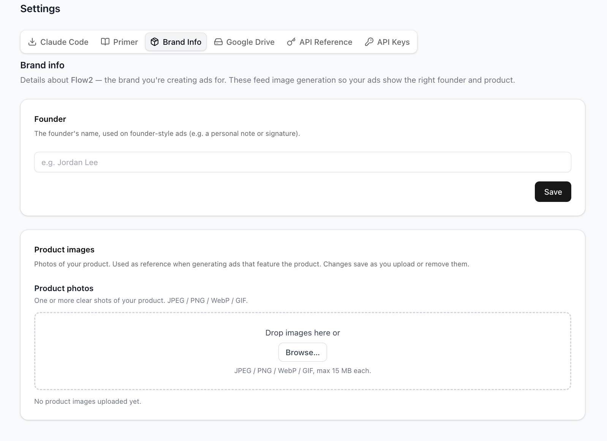

**Screenshot:**

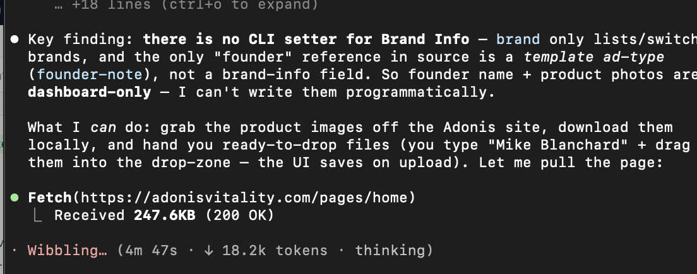

- **Expected:** before a run that needs founder/product, the system **checks Brand Info and warns/prompts if empty** (don't silently render generic); `doctor` reports **both** layers separately and honestly (copy foundation completeness *and* Brand Info presence); a **CLI path** exists to set founder + add product photos.
- **Proposed fix:**
  1. **Run-time validation:** before asset-dependent runs, check Brand Info; if founder/product missing, warn or prompt inline (wire into the #48 spec wizard's asset-validation step).
  2. **Honest readiness:** make `doctor` (and any "READY" badge) report the **two layers distinctly** — copy foundation (with the missing Brand Voice / Core Offer called out) and Brand Info (founder/product present?). One "READY" must not paper over an empty image-gen layer.
  3. **Disambiguate the two layers in the UI** so it's obvious which feeds writing vs image gen.
  4. **Add a CLI setter** for Brand Info (set founder, add/remove product photos) so it isn't dashboard-only.
- **Note (don't conflate with #39):** #39 is "templates must *declare/receive* the right inputs"; **#50** is "the system claims ready, never validates the empty assets, splits the data confusingly, and gives no CLI to fill it." Related, distinct.
- **Status:** open — **needs Brad input** on unifying/labeling the two layers and where the CLI setter lives.

---


### #51 — Manual template runs cap at 50 images/run; front door should auto-split or warn
- **Area:** CLI generation front door (`exodus image` / `template`, manual mode).
- **Severity:** P1 — a legitimate spec ("2 of all 33 ad-types" = 66) **errors** instead of running.
- **What:** Manual template mode **maxes at 50 images per run.** Asking for **2 per all 33 ad-types = 66** exceeds the cap, so the run fails. The CLI agent had to **hand-split** it into two runs (25 formats → 50, + 8 formats → 16 = 66) to honor the request — the tool didn't do this. Lucas: *"see if we can fix this."*
- **Where:** `image`/`template` manual mode; the per-run image ceiling.
- **Repro:** request manual template, all 33 ad-types × 2 → 66 images → run errors on the 50-cap.
- **Screenshot:** *(none — runtime error; the 33-type set is `screenshots/48-wizard-manual-adtypes.png`)*
- **Expected:** the front door **auto-splits** an over-cap batch into N runs under the limit (transparently), **or warns up front** with the count and the split it will perform — never a hard error mid-spec.
- **Proposed fix:**
  1. **Auto-chunk** at submit: compute total images; if > 50, split into ⌈total/50⌉ runs and fire sequentially (respect the Genesis VPS 1-concurrent limit — v1.2 A.44).
  2. **Or warn + confirm:** "66 images exceeds the 50/run cap — I'll split into 2 runs (50 + 16). Proceed?"
  3. Surface the cap in the spec wizard's count step so it's visible before submit.
- **Status:** open — re-surfaces **v1.2 #33** (50-cap). (Logged in `reference_exodus_image_engines` gaps.)

### #52 — [#1 ISSUE] Steering must be explicitly requested, first-class — incl. steering-only (no copy) and steering-emphasis
- **Area:** Generation spec flow (the spec wizard's **Native** wave) — CLI `exodus image --steer` + dashboard New batch run.
- **Severity:** **P0** — Lucas's single most important issue. Blocks his core use case if wrong.
- **What:** The flow **MUST ask the operator for their specific steering instructions, every time** — never skip it, never bury it as "(optional)" at the bottom. Two first-class modes must work:
  1. **Steering-only (no ad copy):** a run *for* an ad where the operator deliberately does **not** include ad copy — they want **only their steering** to drive the render. (Native `--steer` with no copy → steering becomes the brief; the flow must offer this, not require copy.)
  2. **Steering-emphasis:** copy is included, but the operator wants steering **weighted as the primary driver**.
- **Lucas (verbatim, 2026-06-03 — every word, as he required):**
  > "the ONLY big issue OVERALL and iTS REALLY FUCKING IMPROTANT... IT MUST Ask for my specific steering information because sometimes it's for an ad, but I don't even want to include the ad copy. I just want my steering instructions, or I want to emphasize my steering instructions. That is fucking, fucking, fucking, fucking, fucking, fucking, fucking, fucking important, and include every single one of those fucks in this GitHub."
- **Where:** Native wave of the spec wizard; CLI `--steer`/`--direction`; dashboard New batch run "Steering / image direction" field.
- **Repro:** start a generation spec → there's no guaranteed prompt for steering, and a no-copy / steering-only path isn't offered (copy is treated as required — see #37).
- **Expected:** every Native run **asks for steering instructions** as a prominent first-class input; a run can proceed with **steering and no copy**; steering can be marked as the emphasized/primary driver.
- **Proposed fix:**
  1. **Always ask for steering** in the Native wave — prominent free-text, not optional-at-the-bottom.
  2. **Allow steering-only runs** — no ad copy required when steering is present (Native renders from steering as the brief).
  3. **Add a steering-emphasis** option (weight steering as primary when copy is also present).
  4. Keep steering **Native-only** (clean split); surface + ask every time.
- **Cross-ref:** #37 (dashboard: make ad copy conditionally required / allow steering-only). This is the elevated, P0 version of that.
- **Repeat incident (2026-06-03) — proves how easy this is to violate:** when generating the 4-ad Native batch, the flow **menued the config but then authored the steering text itself and fired 60 Native runs** with placeholder steering — without asking Lucas for his directions. With **no cancel (#49)**, those 60 ran to completion as a throwaway "rough first look." This is the exact failure #52 + the *elicit-never-assume* rule guard against, on the single input flagged most important. The fix isn't just "have a steering field" — the flow (and the agent) must **stop and ask for the operator's steering before firing**, every time.
- **Status:** open — **top priority.**

---

## Copy pipeline (genesis writer) — findings

> New surface (2026-06-03): feedback on the **copy itself** — the `genesis` writer. Raw idea → **Path A** (`genesis run --brief "<idea>"`) or **Path B** (idea bank: `idea gambit "<dump>"` splits → `idea write <KEY>`) → Genesis writer → Google Doc. Knobs: `--awareness` (unaware · problem-aware [default] · solution-aware · product-aware) · `--variants` (1–10, default 6) · `--seeds` (per-run creative seeds, brief mode).

### #53 — Copy flow: "what do you want done with this idea?" gate (Write / Both / Just save) — ✅ approved direction
- **Area:** Copy flow — the decision point after a **raw idea** is given, before `genesis` writes.
- **Severity:** ✅ approved design (Lucas: *"kinda like this"*) — capture as the build-to direction, minor wording TBD.
- **What:** A menu — **"Frame-control idea — what do you want me to do with it?"**:
  1. **Write the ad** — send straight to genesis and write the copy now (banks nothing). *The default most people want.*
  2. **Both** — write the ad now **AND** save it to the Idea Bank so it's reusable later.
  3. **Just save it** — bank the idea in the Idea Bank (`idea add`); don't write copy yet.
  4. Type something · 5. Chat about this.
- **Why it's right:** matches Lucas's **SOG mental model** — every ideation source should support *both* "rip end-to-end" (Write) and "just bank the seed for later" (Just save), plus Both. Banked ideation as a first-class primitive, addressable later via `idea write <KEY>`.
- **Where:** copy flow gate, after raw idea / before genesis. (Mirrors the image-gen "who decides" gate — one explicit decision per screen, menu of questions.)
**Screenshot:**

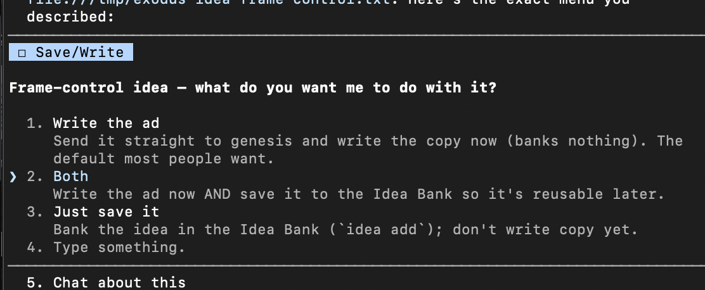

- **Expected / direction:** keep this gate. It correctly separates **ideation (bank)** from **copy (write)** so the operator can stop at seeds or rip through — their call, asked not assumed.
- **Status:** ✅ approved-as-direction — "kinda like this." (Refine wording on a later pass if needed.)

### #54 — Idea Bank → writer dispatch silently skips an already-running idea; can't re-generate the same idea
- **Area:** Copy flow — **Idea Bank → "write/dispatch to writer"** action (dashboard).
- **Severity:** P1 — blocks a legitimate workflow (generating the same idea more than once) and fails silently.
- **What:** Dispatching an idea from the Idea Bank to the genesis writer returned a toast: **"Dispatched 0 idea(s) to the writer. Skipped 1."** — nothing new was written. The idea card (**G2 · Gambit · "Writing…"** — *"She won't leave for the better-looking man — she'll leave for the more certain one"*, with **Notes (steering)** = *"make this as AGGRESSIVE and t…"*) already had a **Brief run "running / No doc yet"** (Jun 3, 4:05 PM). So the dispatch was **skipped because a run for that idea was already in flight** (a too-aggressive de-dupe). Lucas: *"I tried to launch from the ideas thing. It's not really working… I think it's because it's already running maybe the same idea, but **you should be able to generate it multiple times.**"*
  - *(Aside: the idea card carries a **Notes (steering)** field — good, supports #52's steering-as-first-class; the bug is purely the dispatch skip.)*
- **Where:** Idea Bank list → select idea → dispatch to writer; the "Dispatched 0… Skipped 1" toast; idea card "Writing…" badge; the running Brief run showing "No doc yet."
- **Repro:**
  1. An idea already has a writer run in progress (or was dispatched once).
  2. Select that idea and dispatch to the writer again.
  3. Toast: **"Dispatched 0 idea(s) to the writer. Skipped 1"** — no new run fires.
**Screenshot:**

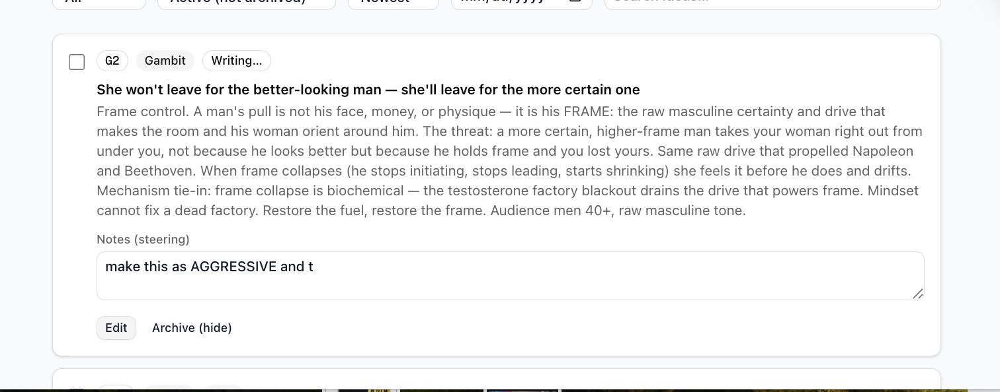

**Screenshot:**

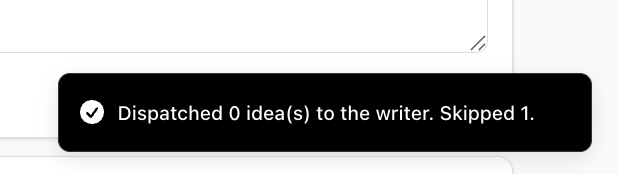

**Screenshot:**

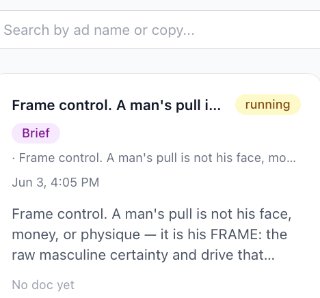

- **Expected:** each dispatch creates a **new** genesis run; the same idea can be generated **multiple times** (repeat or concurrent). At most a **soft confirm** ("a run for this is already in progress — generate again?"), never a silent skip. The toast must state **why** anything was skipped.
- **Proposed fix:**
  1. **Allow re-dispatch** — don't block on "already running / already written." Each dispatch = a fresh genesis run for that idea.
  2. If guarding accidental double-fire, make it a **confirm**, not a hard skip.
  3. **Explain skips** in the toast ("Skipped 1: already running — generate again?") instead of an opaque "Skipped 1."
  4. Surface **per-idea run history** (N runs) so repeat generations are visible from the bank.
- **Root cause (confirmed this session):** the idea is **locked while its writer run is in flight** — so every re-dispatch (steering note and all) is skipped until the first run finishes. `genesis run --brief` bypasses the lock entirely (writes without touching the bank lock). The fix is to stop locking the idea against re-dispatch (or make the lock a soft confirm).
- **Status:** open.

### #55 — Template renders fail under concurrency: `claimRenderSlot` OptimisticConcurrencyControlFailure (503)
- **Area:** Template render backend — Convex mutation `creativeSuiteTemplate:claimRenderSlot` (table `creativeSuiteTemplateRenders`) → dashboard render grid.
- **Severity:** P1 — silent **partial failure of a paid batch**; a large share of renders fail, with no auto-retry.
- **What:** In the big template batch (the 264-render run, split into several runs per #51's 50-cap), **a lot of renders worked but a lot FAILED.** Failed tiles render **"Failed"** + the error:
  > `Convex mutation creativeSuiteTemplate:claimRenderSlot failed (503): {"code":"OptimisticConcurrencyControlFailure","message":"Documents read from or written to the \"creativeSuiteTemplateRenders\" table ..."}`
  - Failed ad-types seen in one screen: **HERO · HOLDING-SIGN · NATIVE-NEWS · STATISTICS · BEFORE-AFTER · INFOGRAPHIC · HAPPY-AVATAR · PRODUCT-BREAKDOWN** (one tile — the FLOW tub — rendered fine).
  - This is **write contention**: many renders claiming slots in the **same table at once** trip Convex's optimistic-concurrency control. The #51 50-cap split (multiple runs firing together) **amplifies** it.
- **Where:** dashboard render grid (template); backend `creativeSuiteTemplate:claimRenderSlot`.
- **Repro:** fire a large template batch (many renders / multiple concurrent runs, e.g. all 33 × 2 across 4 ads) → a subset of tiles fail with the OCC 503.
**Screenshot:**

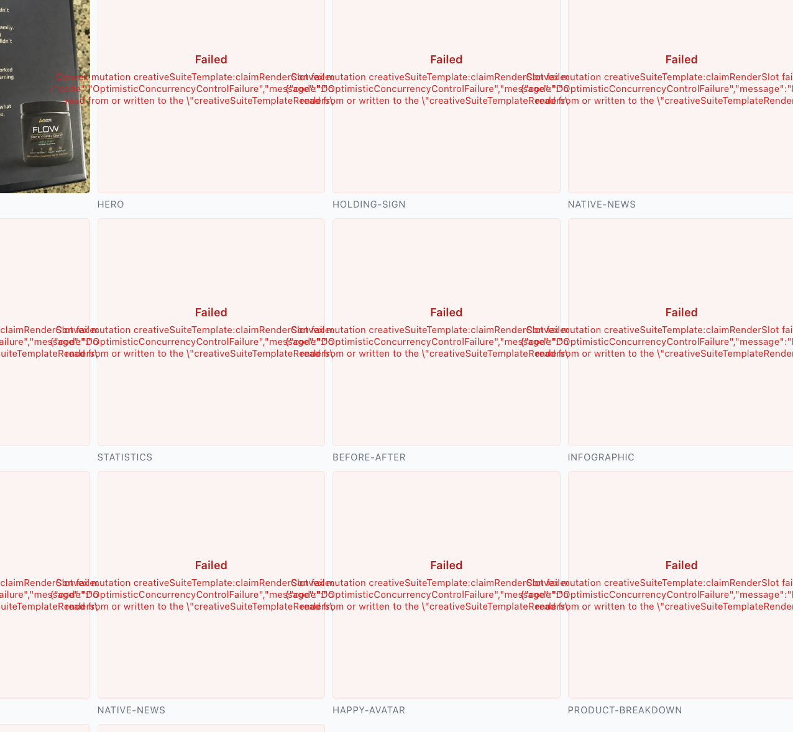

- **Expected:** the batch completes without renders failing on write conflicts; transient contention is retried, not surfaced as a dead "Failed" tile.
- **Proposed fix:**
  1. **Make `claimRenderSlot` OCC-resilient** — retry-with-backoff/jitter on `OptimisticConcurrencyControlFailure`. A surfaced 503 means retries were exhausted or the function design forces hot-document contention.
  2. **Remove the hot-doc bottleneck** — don't read/write a single shared aggregate to claim a slot; shard the counter, or claim per-render rows independently so writes don't collide.
  3. **Throttle concurrent claims** — a server-side concurrency cap on slot-claims (ties to #51's auto-split: split *and* pace).
  4. **Auto-retry failed renders** + add a **"retry failed"** action on the grid; show a clean per-tile error, not the raw Convex string.
- **Status:** open — backend reliability. (Concurrency theme: v1.2 A.44 Genesis VPS; #51 50-cap split.)

### #56 — Ask the pre-write questions before writing ANY copy (offered, never blocking)
- **Area:** Copy flow — the **pre-write spec step** before `genesis` writes (CLI + dashboard). The copy analog of the image-gen #48 spec wizard.
- **Severity:** P1 — **core copy-flow requirement** (embeds the P0 steering rule, #52). Lucas: *"also this is really important to ask before writing any copy."*
- **What:** Before writing an ad, **ask these every time** — offer them, don't assume the answers; the operator answers or skips to a default:
  1. **Segment** — which segment is this for
  2. **Awareness level** — unaware · problem-aware · solution-aware · product-aware
  3. **Primer** — which primer **(don't decide in advance — ASK, and Lucas tells you)** *(cf. dashboard #46 primer editor)*
  4. **Mechanism** — what mechanism it should use
  5. **CTA / call to action** — what are you driving people to / where's it going *(cf. #54)*
  6. **Overall guidelines** — any steering from the operator *(the #52 steering input)*
- **Default rule (Lucas: "really important"):** every question is **OFFERED but NEVER BLOCKS.** If the operator doesn't want to answer one, the run proceeds on a **default**. Same non-blocking principle as #52.
- **Where:** pre-write step in the copy flow (Path A `genesis run --brief` / Path B idea bank → writer).
- **Repro:** start a copy write → there's no consistent pre-write prompt for segment/awareness/primer/mechanism/CTA/steering; settings get assumed.
- **Expected:** a **pre-write menu-of-questions wave** (Segment → Awareness → Primer → Mechanism → CTA → Steering), each with a clear **skip/default** — nothing blocks, primer is **asked not assumed**.
- **Proposed fix:** build the pre-write wave mirroring the image-gen wizard; each question offers options + "use default"; **never** require an answer; **never** pre-decide the primer or author the steering.
- **Cross-ref:** #48 (image spec wizard) · #52 (steering asked, non-blocking) · #54 (CTA/destination) · memory `feedback_exodus_pre_write_copy_checklist`.
- **Status:** open.

### #57 — [SUPER IMPORTANT] No path to ingest raw FB ad copy / a Facebook Ad Library URL into the copy pipeline
- **Area:** Copy pipeline ingestion — `genesis` / the **Swipe** path. (The S in SOG: Swipe · Organic · Gambit.)
- **Severity:** **P0** — Lucas, verbatim: *"this is SUPER FUCKING IMPORTANT: we need to be able to accept these raw FB ad copy stuff."* Swiping competitor FB ads is a core workflow and there's no first-class path for it.
- **What:** There is **no direct "paste a Facebook Ad Library ad / URL → write copy" path.** Confirmed in source:
  - `genesis --reel` = **IG / TikTok only** (no FB Ad Library).
  - `genesis --swipe <id>` = writes from an **already-mined** swipe by internal id — not from a URL or pasted copy.
  - **Swipe mining** ingests at the **page level** (`fbPageRef`), not a single ad.
  - **Nothing ingests a Facebook Ad Library ad id/URL — or pasted raw FB ad copy — directly.**
  - The intended flow simply doesn't exist. Current workaround: someone manually pulls each ad's text off the Ad Library page, then `genesis run --brief` from it (fragile, depends on the page being fetchable — ties to v1.2 #28: scraped-ad data only via the raw endpoint, no CLI command).
- **Where:** `genesis` CLI; the swipe path.
- **Repro:** have a Facebook Ad Library ad URL (or raw FB ad copy) you want to model → there's no command that accepts it; `--reel` rejects FB, `--swipe` wants an internal id.
- **Screenshot:** *(none — CLI capability gap, confirmed in source)*
- **Expected:** **accept raw FB ad copy directly** — both:
  1. **Paste the raw ad copy (text)** → ingest → write from it.
  2. **Paste a FB Ad Library ad URL / id** → fetch the ad's copy (+ creative) → write from it (single-ad, not page-level).
- **Proposed fix:**
  1. `genesis run --fb-ad <url|id>` — fetch a single Ad Library ad's text + creative, ingest, write.
  2. `genesis run --paste "<raw ad copy>"` (or `--swipe-text <file>`) — write directly from pasted competitor copy, no mining round-trip.
  3. **Save ingested ads to the swipe bank** so they're addressable later via `--swipe <id>`.
  4. Fold in the working **beat-map swipe recipe** (v1.2) so the faithful-model path is first-class, not a manual paste.
- **Cross-ref:** v1.2 #28 (scraped-ad data only via raw `/api/v2/swipe-library`, no CLI) · the working swipe recipe (`genesis run --brief` + beat-map) · [[exodus-sog-ideation-framework]] (Swipe axis) · #58 (the broader end-to-end process).
- **Status:** open — **P0, top of the copy backlog.**

### #58 — The swipe pipeline is broken end-to-end: no working path from a competitor ad to written copy
- **Area:** Copy / **Swipe** pipeline — the full chain: `research`/watchlist → resolve advertiser page → `swipe` mine → `genesis --swipe` write.
- **Severity:** P1 — Lucas: *"that process is pretty much all broken… pretty important."* The Swipe axis (S in SOG) is effectively unusable without manual intervention. #57 is the keystone capability; **#58 is the chain around it.**
- **What:** You can't get from *"here's a competitor FB ad"* to *"written copy"* through the product. The chain assumes **page-level** inputs the operator can't easily supply from a single ad:
  - **research / watchlist** needs the real **advertiser/page name** to resolve — can't be derived from a single Ad Library ad link.
  - **mining** runs at the **page level** via `fbPageRef` / `view_all_page_id` — a raw Ad Library *ad* URL doesn't surface that id; you must click the advertiser name and hand-grab it.
  - **`genesis --swipe <id>`** needs an **already-mined** internal id.
  - Net: every route requires the operator to **manually grab** advertiser names, page-level URLs, or paste the ad text. Nothing chains automatically from an ad link.
- **The wall:** the FB Ad Library *ad* link exposes ad-level info, **not the page id** the pipeline depends on.
- **Where:** `research`, `swipe mine`, `genesis --swipe`; the FB Ad Library URL structure.
- **Repro:** start from a single competitor Ad Library ad → try to produce copy → blocked at every step (research wants a name, mining wants a page id, `--swipe` wants a mined id).
- **Screenshot:** *(none — process/capability gap)*
- **Expected:** a working chain from a competitor ad/URL (or pasted copy) → written copy — ideally **auto-resolve the page id from a single ad URL**, then mine → write in one flow.
- **Proposed fix:**
  1. **Auto-resolve `view_all_page_id` from a single Ad Library ad URL** so the operator never hand-grabs it.
  2. **Accept three entry points** — advertiser/page name · page-level URL · pasted ad copy/ad URL (ties #57).
  3. **Chain research → mine → write** in one runnable flow once a page/ad is identified.
  4. Surface the supported entry inputs in the UI/CLI help so the path is discoverable.
- **Cross-ref:** **#57** (single-ad/raw-copy ingestion — the keystone) · v1.2 **#28** (no CLI for scraped data) · v1.2 **#30** (mining failures / MGTM won't scrape) · [[exodus-sog-ideation-framework]].
- **Status:** open.

### #59 — Swipe Library: capture + surface the metadata ScrapeCreators already returns; kill the 200 cap; sort/score/search
- **Area:** Swipe Library — the script-creator / **ScrapeCreators** ingestion + the library store + `--list-swipes` / library UI.
- **Severity:** P1 — high-value, mostly "store what's already upstream + surface it." (Lucas supplied this as a **copy-ready note for Brad**.)
- **The core ask:** capture and surface the metadata **ScrapeCreators already returns**, and **stop capping the library at 200.** Right now Exodus stores only `headline / body / CTA / transcript` and caps `--list-swipes` at 200 — discarding the rest and not paginating.
- **What ScrapeCreators already gives us per ad (we're dropping most of it):**
  - `impressions_with_index` (impressions text + index) + `reach_estimate` — **impression / reach data**
  - `start_date` / `end_date` (Unix) — **dates**
  - `total_active_time` (seconds) — **longevity, exact** *(note: v1.2 #29 flagged "no daysRunning" — it exists upstream, just dropped)*
  - `collation_count` — **number of variants in the campaign** (winning proxy)
  - `spend`, `is_active` / `status`, `publisher_platform`
  - `cursor` + `searchResultsCount` — **pagination + true total (so: way more than 200 available)**
- **What we want to do with it:**
  - **Swipe/save** any competitor ad into the library.
  - **Sort** by: date · longevity (`total_active_time`) · variant count (`collation_count`) · impression proxy.
  - **Score** = combine **impressions × longevity** (and variant count) into one "what's working" number. Multiply the proxies.
  - **Filter** by brand, by date range (e.g. last 7 days), by active status.
  - **Semantic search on hooks** — search the opening hooks/copy, cluster by hook type, "find me hooks like this one."
  - **No 200 cap** — paginate via `cursor`; show true total ("showing 50 of 1,240").
- **Mining fix:** mining pulls a brand's **entire catalog** — multi-product brands flood the library with off-niche ads. Let us **niche-filter / scope** which ads get pulled.
- **Proposed fix (summary):** persist the full ScrapeCreators payload per ad (not just headline/body/CTA/transcript); paginate `--list-swipes` via `cursor` + expose `searchResultsCount`; add sort/filter/score (impressions × longevity × variants); semantic hook search + clustering; scope/niche-filter on mining.
- **Screenshot:** *(none — copy-ready data/feature spec)*
- **Cross-ref:** #57/#58 (swipe ingestion + pipeline) · v1.2 #28 (scraped data only via raw endpoint) · v1.2 #29 (the "no daysRunning" gap — resolved by storing `total_active_time`) · #40 (dashboard search) · [[exodus-sog-ideation-framework]].
- **Status:** open.

---

## Action index (for Brad)

| Action | Finding | Severity | One-liner | Status |
|---|---|---|---|---|
| A.61 | #52 | **P0** | Steering = always-asked first-class input; support steering-ONLY (no copy) + steering-EMPHASIS; Native-only | open · top-priority |
| A.55 | #47 | P1 | Fix "Native" taxonomy: rename CLI `--type native` (→ Reptile); label runs by engine, never "Native"; make card title+badge agree | open |
| A.56 | #48 | P1 | Add spec step before generation (build to the Engine→Scope→Aspect→Count→Submit wizard + the F1–F6 run formats); default to nothing; validate assets; never auto-fire a suite | open · needs-brad-input |
| A.57 | #49 | P2 | Add CLI cancel (`exodus image cancel <runId>`/batch) + dashboard Cancel button; free the queue slot | open |
| A.58 | #50 | P1 | Validate Brand Info before asset-dependent runs; make `doctor` report both brand layers honestly; disambiguate copy-foundation vs Brand-Info; add CLI setter for founder/product | open · needs-brad-input |
| A.59 | #51 | P1 | Auto-split over-cap manual template batches (or warn+confirm) instead of erroring at 50 images/run; show the cap in the count step | open |
| A.60 | #48 (W3) | P1 | Manual ad-type picker = grouped checklist with inline per-type count stepper (not free-text) + same/per-ad toggle | open |
| A.62 | #53 | ✅ | Keep the copy ideation gate (Write / Both / Just save) — banks-vs-writes split per the SOG model | approved-direction |
| A.63 | #54 | P1 | Allow re-dispatching an idea to the writer (N generations); stop locking idea against re-dispatch (or soft-confirm); toast must explain skips; show per-idea run history | open |
| A.64 | #55 | P1 | Make `claimRenderSlot` OCC-resilient (retry+backoff); remove hot-doc contention (shard/per-row); throttle concurrent claims; auto-retry + "retry failed" UI | open |
| A.65 | #56 | P1 | Pre-write copy wave: ask Segment·Awareness·Primer·Mechanism·CTA·Steering every time; offered, non-blocking defaults; never pre-decide primer or author steering | open |
| A.66 | #57 | **P0** | Accept raw FB ad copy + FB Ad Library URL/id directly into genesis (`--fb-ad <url\|id>`, `--paste "<copy>"`); save to swipe bank; fold in beat-map recipe | open · top-of-copy-backlog |
| A.67 | #58 | P1 | Make swipe chain work end-to-end: auto-resolve page id from an ad URL; accept name/page-URL/paste entry points; chain research→mine→write in one flow | open |
| A.68 | #59 | P1 | Persist full ScrapeCreators metadata (impressions/reach/dates/total_active_time/collation_count/spend/status); paginate via cursor (kill 200 cap); sort/score (impr×longevity×variants)/filter; semantic hook search; scope mining | open |

---

## Open questions for Brad / Lucas

- **#47:** keep CLI `--type native` as a back-compat alias (resolving to Reptile) or hard-rename to `--engine reptile`?
- **#48:** port the spec wizard into the dashboard modal, or keep the wizard CLI-only and just stop the modal's implicit suite?
- **#50:** unify the two brand layers (copy foundation + Brand Info) into one surface, or keep separate but cross-validate? And where should the CLI Brand-Info setter live (`exodus brand info …`)?
- **Brand-isolation (flag):** is `flow2` genuinely the Adonis Vitality brand (so pulling Mike Blanchard + adonisvitality.com product images is correct), or a clean test brand (so that would contaminate the audit per the fresh-content hard rule)?
